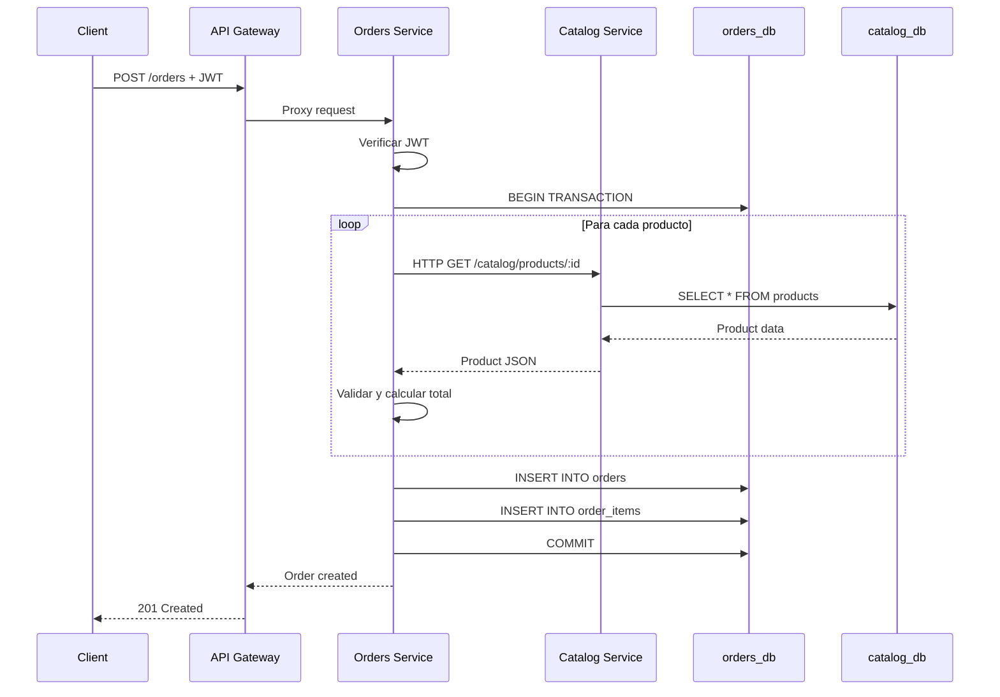

# E-commerce con Arquitectura de Microservicios

Backend distribuido en microservicios independientes con Node.js, Express y PostgreSQL.

## 🏗️ Arquitectura

```
┌─────────────────────────────────────────────────────────────┐
│                        Cliente/Frontend                      │
└────────────────────────┬────────────────────────────────────┘
                         │ HTTP
                         ▼
┌─────────────────────────────────────────────────────────────┐
│                     API Gateway :3000                        │
│                    (Punto de entrada único)                  │
└──────┬──────────────────┬──────────────────┬────────────────┘
       │                  │                  │
       │ Proxy            │ Proxy            │ Proxy
       ▼                  ▼                  ▼
┌──────────────┐   ┌──────────────┐   ┌──────────────┐
│ Auth Service │   │Catalog Service│   │Orders Service│
│    :3001     │   │    :3002      │   │    :3003     │
└──────┬───────┘   └──────┬────────┘   └──────┬───────┘
       │                  │                    │
       │                  │                    │ HTTP GET
       │                  │                    │ /products/:id
       │                  │ ◄──────────────────┘
       │                  │
       ▼                  ▼                    ▼
┌──────────────┐   ┌──────────────┐   ┌──────────────┐
│   auth_db    │   │  catalog_db  │   │  orders_db   │
│  PostgreSQL  │   │  PostgreSQL  │   │  PostgreSQL  │
│    :5432     │   │    :5433     │   │    :5434     │
└──────────────┘   └──────────────┘   └──────────────┘
```

## 🔑 Características Clave

### Separación de Responsabilidades
- **Auth Service:** Autenticación y gestión de usuarios
- **Catalog Service:** Catálogo de productos
- **Orders Service:** Gestión de pedidos
- **API Gateway:** Enrutamiento y punto de entrada único

### Bases de Datos Separadas
Cada servicio tiene su propia base de datos PostgreSQL:
- `auth_db` - Usuarios
- `catalog_db` - Productos
- `orders_db` - Pedidos y items

### Comunicación entre Servicios
**Orders Service hace llamadas HTTP a Catalog Service** para validar productos:
```javascript
// En Orders Service
const product = await axios.get('http://catalog-service:3002/catalog/products/1');
```

Esto demuestra la diferencia clave vs el monolito:
- **Monolito:** `SELECT * FROM products WHERE id = 1` (SQL directo)
- **Microservicios:** HTTP GET a Catalog Service (latencia de red)

## 🚀 Cómo Ejecutar

### Prerrequisitos
- Docker
- Docker Compose

### Pasos

1. **Navegar al directorio**
```bash
cd microservicios
```

2. **Levantar todos los servicios**
```bash
docker compose up --build
```

Esto levantará:
- 3 bases de datos PostgreSQL
- 4 servicios (Auth, Catalog, Orders, API Gateway)
- Frontend servido por el Gateway

3. **Acceder a la aplicación**
- **Frontend:** http://localhost:3000
- **API Gateway:** http://localhost:3000/health
- **Auth Service:** http://localhost:3001/auth/health
- **Catalog Service:** http://localhost:3002/catalog/health
- **Orders Service:** http://localhost:3003/orders/health

4. **Credenciales de prueba**
- Email: `demo@demo.com`
- Password: `demo1234`

## 📡 Endpoints API

### A través del API Gateway

#### Auth
- `POST /auth/login` - Iniciar sesión
- `GET /auth/me` - Usuario autenticado

#### Catalog
- `GET /catalog/products` - Listar productos
- `GET /catalog/products/:id` - Obtener producto

#### Orders
- `GET /orders` - Listar pedidos (requiere JWT)
- `POST /orders` - Crear pedido (requiere JWT)

### Acceso Directo a Servicios (para debugging)

- Auth Service: `http://localhost:3001/auth/*`
- Catalog Service: `http://localhost:3002/catalog/*`
- Orders Service: `http://localhost:3003/orders/*`

## 🔍 Flujo de Creación de Pedido



### Diferencias vs Monolito

| Aspecto | Monolito | Microservicios |
|---------|----------|----------------|
| **Validación de productos** | SQL directo a tabla `products` | HTTP GET a Catalog Service |
| **Latencia** | ~5-10ms | ~30-50ms (red + procesamiento) |
| **Transacciones** | ACID nativo | Transacción local + llamadas HTTP |
| **Punto de fallo** | Si cae la app, cae todo | Si cae Catalog, Orders no puede validar |
| **Escalabilidad** | Vertical u horizontal completo | Granular por servicio |

## 🧪 Testing

### Verificar Health de Servicios

```bash
# API Gateway
curl http://localhost:3000/health

# Auth Service
curl http://localhost:3001/auth/health

# Catalog Service
curl http://localhost:3002/catalog/health

# Orders Service
curl http://localhost:3003/orders/health
```

### Test de Login

```bash
curl -X POST http://localhost:3000/auth/login \
  -H "Content-Type: application/json" \
  -d '{"email":"demo@demo.com","password":"demo1234"}'
```

### Test de Productos

```bash
curl http://localhost:3000/catalog/products
```

### Test de Creación de Pedido

```bash
# Primero obtener token del login
TOKEN="tu_token_aqui"

curl -X POST http://localhost:3000/orders \
  -H "Content-Type: application/json" \
  -H "Authorization: Bearer $TOKEN" \
  -d '{"items":[{"productId":1,"quantity":2}]}'
```

### Verificar Llamadas HTTP entre Servicios

Observa los logs para ver las llamadas HTTP:

```bash
docker compose logs -f orders-service
```

Deberías ver:
```
[Orders Service] 🌐 Llamada HTTP a Catalog Service: GET /catalog/products/1
[Orders Service] ✅ Respuesta de Catalog Service: Laptop Lenovo ThinkPad
```

## 🛠️ Comandos Útiles

```bash
# Ver logs de todos los servicios
docker compose logs -f

# Ver logs de un servicio específico
docker compose logs -f orders-service

# Detener servicios
docker compose down

# Detener y eliminar volúmenes (reset DBs)
docker compose down -v

# Reconstruir sin caché
docker compose build --no-cache

# Escalar un servicio (ejemplo: 3 instancias de Catalog)
docker compose up --scale catalog-service=3
```

## 🔒 Seguridad

- JWT para autenticación stateless
- Bcrypt para hashing de contraseñas
- CORS habilitado en API Gateway
- Prepared statements en queries SQL
- Secrets configurables por variables de entorno

## 📊 Ventajas vs Monolito

✅ **Escalabilidad granular:** Escalar solo Catalog si hay muchas consultas  
✅ **Independencia de desarrollo:** Equipos separados por servicio  
✅ **Tolerancia a fallos:** Un servicio caído no tumba todo  
✅ **Tecnologías heterogéneas:** Cada servicio puede usar su stack  
✅ **Despliegues independientes:** Actualizar Orders sin tocar Auth  

## ⚠️ Desventajas vs Monolito

❌ **Mayor complejidad:** Más infraestructura y configuración  
❌ **Latencia de red:** Llamadas HTTP entre servicios  
❌ **Consistencia eventual:** No hay transacciones ACID distribuidas  
❌ **Debugging complejo:** Trazas distribuidas entre servicios  
❌ **Overhead de comunicación:** Serialización JSON, HTTP overhead  

## 📈 Observabilidad

### Logs Estructurados

Cada servicio logea con prefijo identificador:
- `[Auth Service]`
- `[Catalog Service]`
- `[Orders Service]`
- `[API Gateway]`

### Monitoreo de Llamadas HTTP

Orders Service logea todas las llamadas a Catalog:
```
🌐 Llamada HTTP a Catalog Service
✅ Respuesta exitosa
❌ Error de conexión
```

## 🎯 Casos de Uso Educativos

### Demostrar Latencia de Red

1. Crear pedido en monolito (medir tiempo)
2. Crear pedido en microservicios (medir tiempo)
3. Comparar diferencia

### Demostrar Tolerancia a Fallos

```bash
# Detener Catalog Service
docker compose stop catalog-service

# Intentar crear pedido
# Resultado: Error 503 - Catalog Service no disponible

# En monolito, esto no pasaría (todo en una app)
```

### Demostrar Escalabilidad

```bash
# Escalar solo Catalog Service
docker compose up --scale catalog-service=3

# El Gateway hará round-robin entre las 3 instancias
```

## 📚 Stack Tecnológico

| Componente | Tecnología |
|------------|------------|
| Runtime | Node.js 20 Alpine |
| Framework | Express |
| Bases de Datos | PostgreSQL 15 |
| Auth | JWT + bcrypt |
| HTTP Client | Axios |
| Proxy | http-proxy-middleware |
| Containerización | Docker + Docker Compose |

## 🔗 Comparación con Monolito

Ver el directorio `../monolito` para comparar:
- Mismo frontend
- Misma funcionalidad
- Diferentes arquitecturas
- Diferentes trade-offs

## 📞 Troubleshooting

### Error: "Catalog Service no disponible"

```bash
# Verificar que Catalog Service está corriendo
docker compose ps catalog-service

# Ver logs
docker compose logs catalog-service

# Reiniciar servicio
docker compose restart catalog-service
```

### Error: "Database connection failed"

```bash
# Verificar health de bases de datos
docker compose ps auth-db catalog-db orders-db

# Reiniciar bases de datos
docker compose restart auth-db catalog-db orders-db
```

### Frontend no carga

```bash
# Verificar que API Gateway está corriendo
docker compose ps api-gateway

# Verificar que el volumen del frontend está montado
docker compose config | grep -A 5 api-gateway
```

---

**Proyecto educativo para ADI - Comparación Monolito vs Microservicios**
